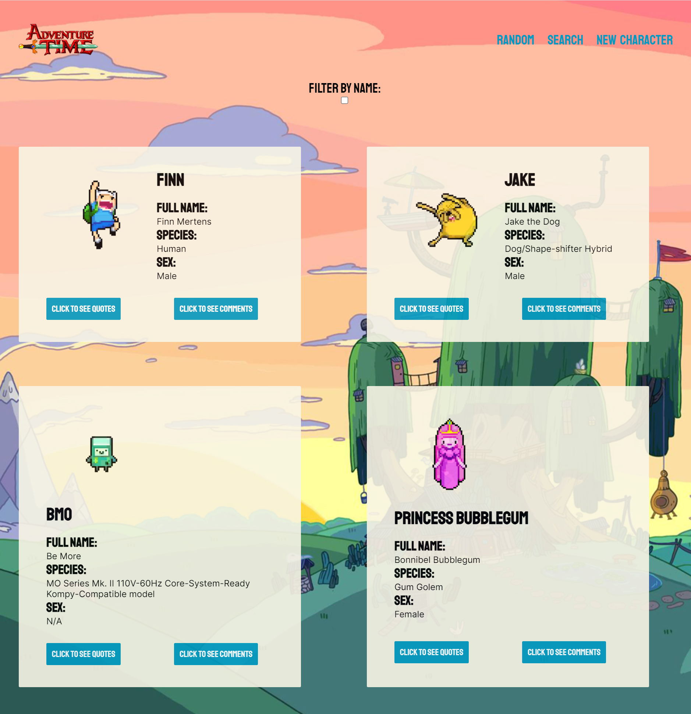

# Adventure Time App

C'mon grab your friends, it's time to go to very distant lands! 

## Introduction
This project was completed as part of Phase 2 at Flatiron School. It is a SPA that exhibits a database of Adventure Time characters. 
## Functionality

- See cards with information about each character in the database.
- Sort the cards by character name.
- Click the quotes button to see a character's quotes.
- Click the comments button to see comments, and add your own comment
- Click the random button to see a random character
- Search will filter characters on the fly
- Add a new character with the new character form. 

## Technologies
React

## Contributors 

- Megan Moulos
- Bryan Meadows
- Teejay Dixon

